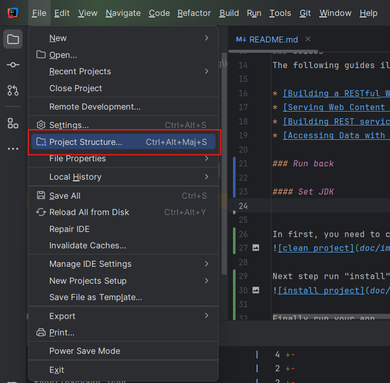
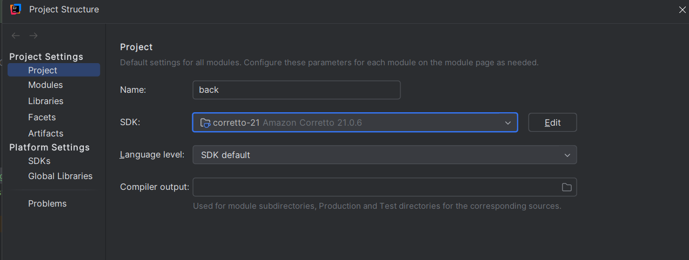
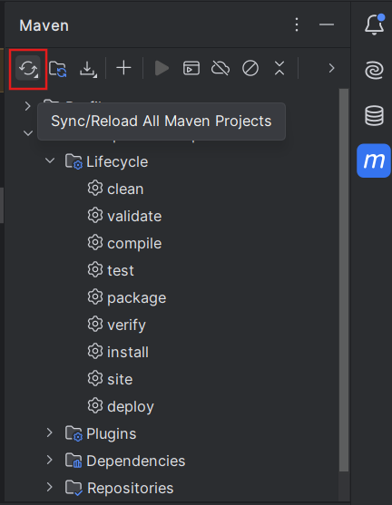
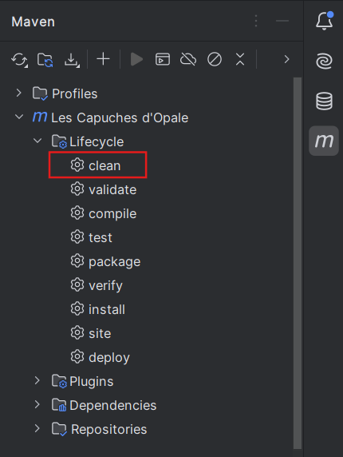
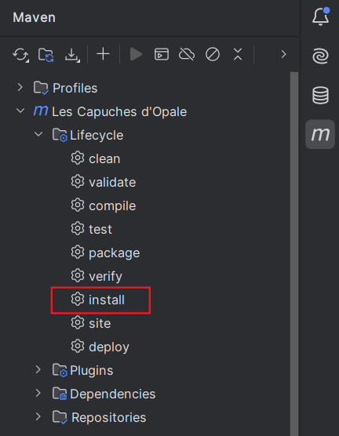

# Getting Started

### Reference Documentation
For further reference, please consider the following sections:

* [Official Apache Maven documentation](https://maven.apache.org/guides/index.html)
* [Spring Boot Maven Plugin Reference Guide](https://docs.spring.io/spring-boot/3.4.2/maven-plugin)
* [Create an OCI image](https://docs.spring.io/spring-boot/3.4.2/maven-plugin/build-image.html)
* [Spring Web](https://docs.spring.io/spring-boot/3.4.2/reference/web/servlet.html)
* [Spring Data JPA](https://docs.spring.io/spring-boot/3.4.2/reference/data/sql.html#data.sql.jpa-and-spring-data)
* [Spring Boot DevTools](https://docs.spring.io/spring-boot/3.4.2/reference/using/devtools.html)

### Guides
The following guides illustrate how to use some features concretely:

* [Building a RESTful Web Service](https://spring.io/guides/gs/rest-service/)
* [Serving Web Content with Spring MVC](https://spring.io/guides/gs/serving-web-content/)
* [Building REST services with Spring](https://spring.io/guides/tutorials/rest/)
* [Accessing Data with JPA](https://spring.io/guides/gs/accessing-data-jpa/)

---

# 🚀 Lancer le backend

## 🌟 API de l'application web Capuches d'Opale

### 🔧 Versions utilisées
- **Java** : 21
- **Spring Boot** : 3.4.2

### 📖 Documentation OpenAPI

Le swagger de l'API est accessible **[ici](../swagger-capuches-opale.yml)**.

## 🛠️ Configuration du JDK

1. **Ouvrir les paramètres du projet**
    - Allez dans **"File" > "Project Structure"**
    - Sélectionnez **"SDKs"**  
      

2. **Télécharger et sélectionner le JDK**
    - Cliquez sur **"Download JDK"** et choisissez une version compatible  
      

## 📦 Build et exécution

1. **Synchroniser le projet**
    - Avant toute chose, synchronisez le projet pour que les librairies soient bien à jour
      

2. **Nettoyer le projet**
    - Avant de compiler, assurez-vous que le projet est propre  
      

3. **Installer les dépendances et compiler**
    - Exécutez la commande **install** pour télécharger les dépendances et compiler le projet  
      

4. **Lancer l'application**
    - Une fois la compilation terminée, démarrez l’application  
      

---

# ❗ Troubleshooting

## ❌ Erreur lors du run du projet : méthode `log` non reconnue

Cette erreur survient généralement lorsque le **processing d'annotations** n'est pas bien configuré dans IntelliJ.

### 🔄 Étape 1 : Vérifier la mise à jour d'IntelliJ
Avant toute chose, il est **fortement recommandé** de télécharger la dernière mise à jour d'IntelliJ (**≥ 2024.3.3**).  
Cette version corrige une erreur liée au processing d'annotations.

### ⚙️ Étape 2 : Activer le processing d'annotations

1. **Ouvrir les paramètres IntelliJ**
    - Allez dans **File > Settings**

2. **Activer le processing d'annotations**
    - Naviguez vers **Build, Execution, Deployment > Compiler > Annotation Processors**
    - Vérifiez que la case **_Enable annotation processing_** est bien cochée

3. **Configurer le classpath des annotations**
    - Dans le volet gauche, cliquez sur **capuches.opale**
    - Sélectionnez le radio button **_Obtain processors from project classpath_**  